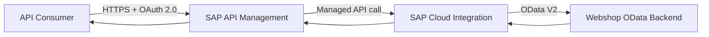

# Enterprise API Gateway

> An enterprise integration architecture case study demonstrating how SAP Integration Suite can be used to expose, secure and govern backend capabilities through an API gateway.

## Overview

The solution separates the **API governance boundary** from the **integration processing layer**:



The architecture is centered on:

**Business Requirements → Architecture → Integration Pattern → Security → API Design → Mapping → Error Handling → Monitoring → Deployment Strategy → Limitations / Future Improvements**

## Business Problem

A backend service exposes product information, but API consumers should not be coupled directly to the backend endpoint or its implementation details.

The solution introduces a governed API boundary that:

- authenticates API consumers;
- abstracts the backend service;
- transforms the consumer request;
- invokes the backend service;
- provides a foundation for API lifecycle governance and operational visibility.

## Architecture

```text
API Consumer
    |
    | OAuth 2.0 access token
    v
SAP API Management
    |
    | POST /products/details
    v
SAP Cloud Integration
    |
    | JSON -> XML
    | Extract productIdentifier
    | Request Reply
    v
OData V2 Backend
```

| Component | Responsibility |
|---|---|
| API Consumer | Obtains an access token and invokes the product API. |
| SAP API Management | API façade, authentication/authorization policies, governance and API-level visibility. |
| SAP Cloud Integration | Transformation, request processing and backend orchestration. |
| OData V2 Backend | Provides product details. |

## API Design

**API:** Product Details API  
**Operation:** `POST /products/details`  
**Authentication:** OAuth 2.0 client credentials

```json
{
  "productIdentifier": "HT-2000"
}
```

The contract intentionally remains limited to what can be established from the implementation. Production response schemas, enterprise SLA/SLO commitments and complete backend contracts are not invented.

## Security

OAuth 2.0 client-credentials authentication is enforced at the API boundary. Secrets, service keys and access tokens are excluded from the repository.

## Operational Model

The architecture defines monitoring and error-handling responsibilities across API Management, Cloud Integration and the backend. Recommended production controls include correlation IDs, latency/error monitoring, alerting, controlled retries and explicit operational ownership.

## Deployment Strategy

The target enterprise lifecycle is:

```text
Development → Test / QA → Production
```

Environment-specific configuration, controlled transport, automated testing and CI/CD are treated as production lifecycle concerns rather than claimed implementation facts.

## Implementation Evidence

Implementation evidence is maintained separately from architecture documentation.

See [`docs/implementation-evidence.md`](docs/implementation-evidence.md). Screenshots are stored under [`evidence/`](evidence/).

## Architecture Decision

The principal decision is to use SAP API Management as the enterprise API boundary while keeping SAP Cloud Integration responsible for transformation and backend orchestration.

See [`docs/adr-001-api-management-as-gateway.md`](docs/adr-001-api-management-as-gateway.md).

## Limitations & Future Improvements

Key future areas include API versioning, consumer onboarding, enterprise identity integration, centralized alerting, CI/CD, complete backend mapping, resilience/reprocessing and SLO/SLA definition.

See [`docs/10-limitations-future-improvements.md`](docs/10-limitations-future-improvements.md).

## Technical Foundation

The hands-on implementation uses SAP Integration Suite capabilities covered by SAP's **Get Started with SAP Integration Suite** learning scenario.

The learning scenario provided the technical foundation for the implemented Cloud Integration and API Management capabilities. This repository presents those capabilities as an independent enterprise architecture case study, adding explicit business, security, API governance, operational and lifecycle perspectives.

## Project Scope Statement

This repository is a **portfolio architecture case study**, not a claim of a production enterprise deployment. Implementation evidence demonstrates what was configured and observed in the SAP environment; architecture documents separately identify production considerations requiring an enterprise environment, real backend contracts and governed delivery processes.
