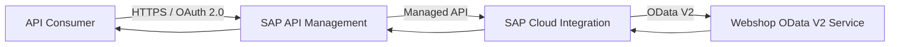
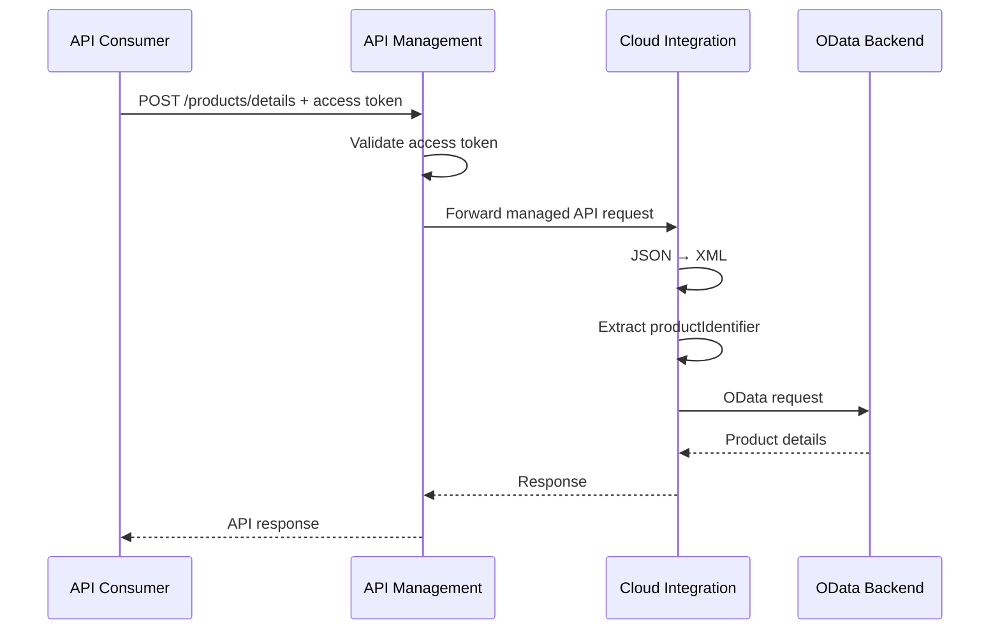

# Architecture

## Architecture Overview

SAP API Management is the governed API boundary and SAP Cloud Integration is the integration processing layer.



## Component Responsibilities

### API Consumer
Obtains an OAuth 2.0 access token and invokes the managed API.

### SAP API Management
Provides the external API boundary, authentication/authorization policies, API governance and API-level operational visibility.

### SAP Cloud Integration
Receives the request, transforms the message, extracts the product identifier and invokes the backend.

### OData V2 Backend
Provides product information.

## Trust Boundaries

1. Consumer → API Management
2. API Management → Cloud Integration
3. Cloud Integration → Backend

## Separation of Concerns

```text
API Governance → API Management
Integration Processing → Cloud Integration
Backend Connectivity → OData Service
```

## Runtime Sequence



## Architectural Principle

API Management provides the stable consumer-facing boundary; Cloud Integration handles message transformation and backend orchestration. This reduces consumer coupling to backend connectivity details.
