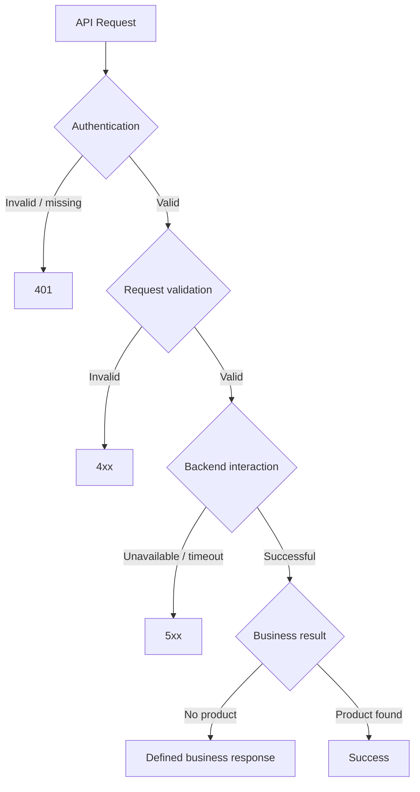

# Error Handling

## Error Domains

## Layered Responsibility

| Failure | Responsible Layer | Recommended Outcome |
|---|---|---|
| Missing/invalid access token | API Management | 401 |
| Insufficient authorization | API Management | 403 |
| Invalid request | API / Integration | 400 |
| Product not found | API contract | Defined business response |
| Backend timeout | Integration / API boundary | 502/504 according to contract |
| Unexpected technical failure | Integration | 500 |

Exact status semantics must be agreed with consumers before production.

## Principles

- Do not expose stack traces or internal URLs.
- Preserve correlation information.
- Distinguish client errors from technical failures.
- Define retry behavior explicitly.
- Avoid unsafe retries for non-idempotent operations.

## Resilience Extensions

Production architecture may require bounded retries, timeouts, controlled reprocessing, dead-letter handling for suitable asynchronous scenarios, alerting and incident integration.
