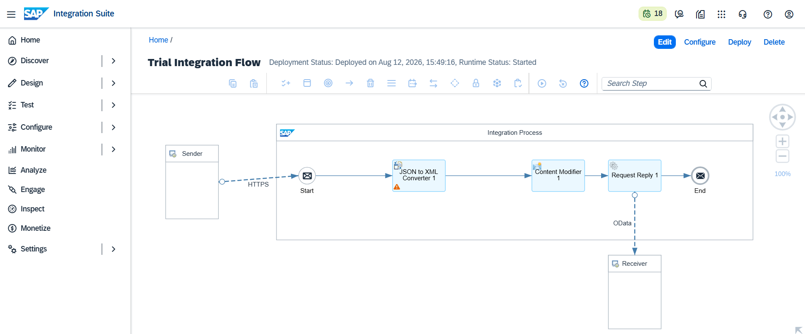
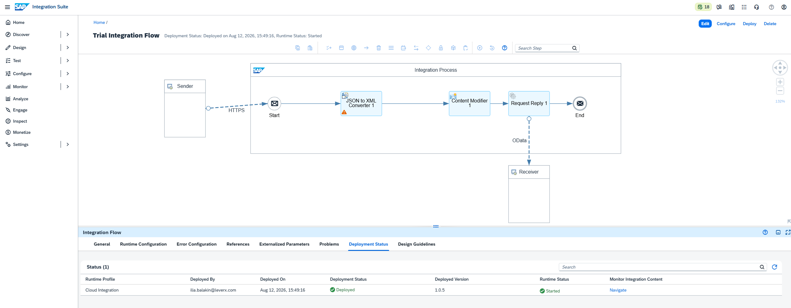
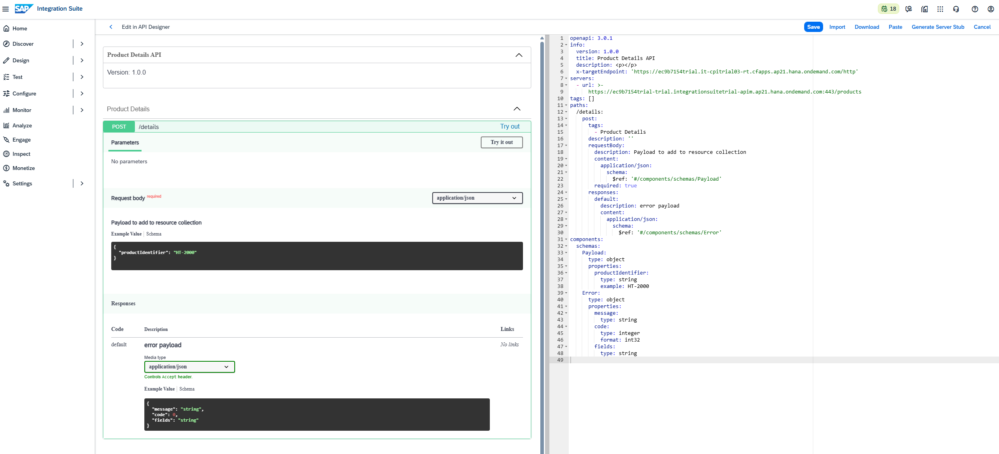

# Implementation Evidence

This section provides implementation evidence for the **Enterprise API Gateway** architecture described in this repository.

The evidence demonstrates the configured SAP Integration Suite components, API exposure, security configuration and runtime behavior.

> Screenshots in this directory should represent the author's own SAP environment and configuration. SAP documentation screenshots are not used as implementation evidence.

## 1. Integration Flow

The integration flow implements the backend integration layer responsible for receiving the API request, transforming the message and invoking the OData backend.

## 2. Runtime Deployment

The integration flow is deployed to the Cloud Integration runtime and exposes an HTTPS endpoint for the API layer.

## 3. API Management

The integration endpoint is exposed through API Management as a governed API interface.

## 4. API Definition

The API exposes the Product Details operation using the defined REST contract.

## 5. OAuth 2.0 Security

OAuth 2.0 client-credentials authentication is applied at the API boundary.

## Evidence Boundary

The screenshots demonstrate what was configured and observed in the SAP environment.

They do not by themselves establish production deployment, enterprise SLA/SLO, production CI/CD, enterprise alerting, complete production backend contracts, production HA/DR or enterprise identity federation. Those concerns are documented separately as architecture and future-state considerations.
