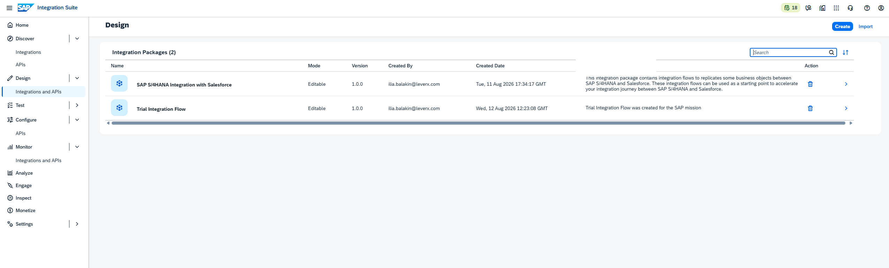
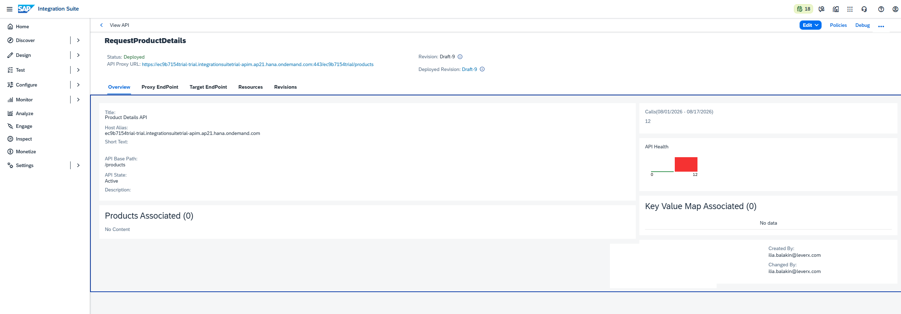
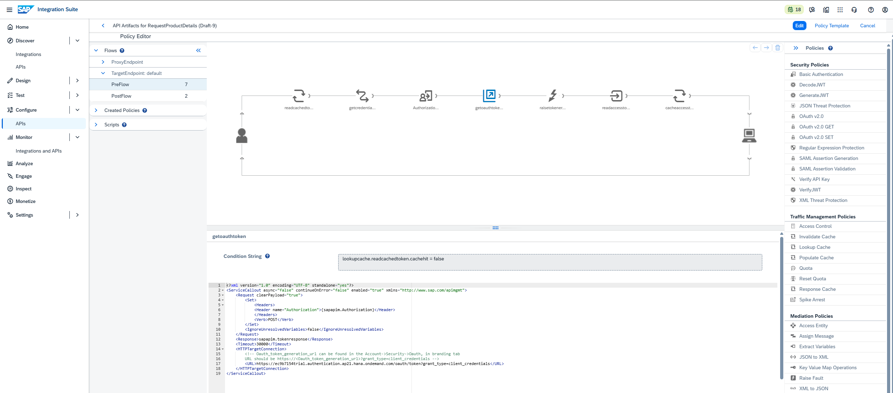
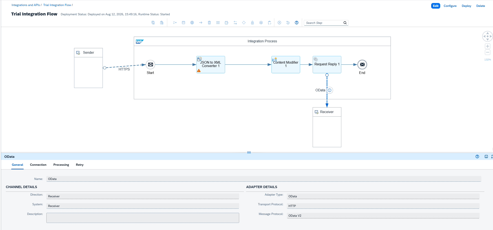

# Implementation Evidence

This section provides implementation evidence for the **Enterprise API Gateway**
architecture described in this repository.

The screenshots below are from the author's SAP Integration Suite trial environment
and are used to distinguish demonstrated configuration from architectural
recommendations and future-state design.

## 1. Integration Flow

The screenshot shows the configured Cloud Integration flow used for the demonstrated
API integration scenario. The visible flow contains an HTTPS sender, JSON-to-XML
conversion, a Content Modifier, a Request Reply step and an OData receiver.

## 2. Runtime Deployment

The screenshot shows the integration flow deployment state. It records the flow as
deployed and the Cloud Integration runtime as started.

## 3. Integration Package

The screenshot shows the Integration Suite Design area with the integration packages
available in the author's environment, including the package containing the trial
integration flow.

## 4. API Definition

The screenshot shows the Product Details API in API Designer, including its OpenAPI
definition, `/details` operation, JSON request body and response structure.

## 5. API Management

The screenshot shows the deployed `RequestProductDetails` API in API Management,
including its API proxy URL, API base path, deployment status and revision information.

## 6. OAuth 2.0 Security

The screenshot shows the API policy flow and the configured OAuth v2.0 policy artifacts.
The visible policy configuration includes an OAuth token request using the
client-credentials grant and propagation of the authorization header.

## 7. OData Backend

The screenshot shows the OData receiver configuration in the Cloud Integration flow,
including OData as the adapter type, HTTP as the transport protocol and OData V2 as
the message protocol.

## Evidence Boundary

The screenshots demonstrate what was configured and observed in the SAP Integration
Suite trial environment.

They do not by themselves establish production deployment, enterprise SLA/SLO,
production CI/CD, enterprise alerting, complete production backend contracts,
production HA/DR or enterprise identity federation. Those concerns remain documented
as architecture and future-state considerations elsewhere in the repository.

## Security Handling

A source screenshot showing the API policy editor also contained a visible client
secret. That original screenshot is **not included in this repository evidence pack**.
Only the security screenshot that does not expose the secret is published.

All screenshots in this evidence pack should be treated as implementation evidence,
not as proof of production readiness.
